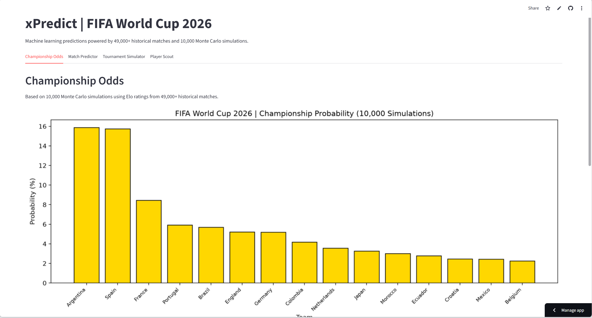

# xPredict | FIFA World Cup 2026 Predictor

A machine learning pipeline that predicts FIFA World Cup 2026 match outcomes and simulates the entire tournament bracket using 150+ years of international football data.

**Live app:** https://xpredict-wc2026.streamlit.app



---

## What it does

- **Championship Odds** - Predicted tournament winner probabilities across all 48 teams based on 10,000 Monte Carlo simulations
- **Match Predictor** - Select any two teams and get win, draw, and loss probabilities powered by a trained ML model
- **Tournament Simulator** - Run a configurable number of bracket simulations (1,000 to 20,000) and see who comes out on top
- **Player Scout** - Explore player stats from the 2022 FIFA World Cup including goals, xG, assists, and card risk per team, with a head to head comparison view

---

## How it works

### Data

- 49,000+ international football results from 1872 to 2026 sourced from Kaggle
- Player and match event data from StatsBomb open data covering 8 FIFA World Cup tournaments (1958 to 2022)

### Feature Engineering

- **Elo ratings** - Built from scratch by processing every match chronologically since 1872. Each match is assigned pre-match Elo ratings so there is no data leakage
- **Recent form** - Win rate over each team's last 10 matches, also computed chronologically
- **Tournament context** - Flags for whether a match is at a World Cup and whether it is played on neutral ground

### Modeling

Three models were trained and compared on post-1990 match data (32,291 matches):

| Model | Accuracy | Log Loss |
|---|---|---|
| Logistic Regression | 60.5% | 0.877 |
| XGBoost | 59.4% | 0.896 |
| Random Forest | 59.2% | 0.911 |

Logistic Regression was selected as the best model. All models were probability-calibrated using `CalibratedClassifierCV`. The fact that Logistic Regression outperforms tree-based models suggests the relationship between Elo difference and match outcome is largely linear, which is consistent with how Elo systems are designed to work.

### v2 Feature Engineering Experiment

As part of v2, a time-aligned player feature set was built using StatsBomb event data across 8 World Cup tournaments. Team-level stats including goals, shots, xG, yellow cards, and top scorer goals were extracted per tournament and joined to historical match data using the previous tournament as the reference point, not the current one, to avoid leakage.

The result was a dataset of 492 matches where both teams had valid prior tournament stats. Cross-validated accuracy on this subset was 53.4%, lower than the v1 baseline. This is expected: fewer training samples with more features typically leads to overfitting, and StatsBomb free data only covers a limited number of teams for most pre-2018 tournaments.

The decision was made to retain the v1 model as the prediction engine and repurpose the player data for the Player Scout tab instead, where it adds genuine value as display information rather than a noisy training signal.

### Simulation

The Tournament Simulator runs Monte Carlo simulations across all 48 teams. In each simulation, matches are decided by sampling from Elo-based win probabilities. After N simulations, championship probability is estimated as the fraction of runs each team won.

---

## Project structure

```
worldcup-2026-predictor/
├── assets/                # App screenshots for README
├── data/
│   ├── raw/               # Downloaded datasets (not committed)
│   └── processed/         # Engineered features, trained model, Elo ratings, player stats
├── notebooks/
│   ├── 01_eda.ipynb
│   ├── 02_feature_engineering.ipynb
│   ├── 03_modeling.ipynb
│   ├── 04_player_data.ipynb
│   └── 05_feature_engineering_v2.ipynb
├── src/
│   ├── features.py        # Elo and form feature engineering
│   ├── model.py           # Model training, evaluation, and prediction
│   └── simulate.py        # Monte Carlo tournament simulation
├── app.py                 # Streamlit dashboard
├── requirements.txt
└── README.md
```

---

## Setup

```bash
git clone https://github.com/rafiaauthoi/worldcup-2026-predictor.git
cd worldcup-2026-predictor
python -m venv venv
venv\Scripts\activate
pip install -r requirements.txt
streamlit run app.py
```

---

## Data sources

- Kaggle: International Football Results 1872 to 2026 (martj42)
- StatsBomb Open Data: Match event data for FIFA World Cup tournaments

---

Built by [Rafia Authoi](https://github.com/rafiaauthoi)